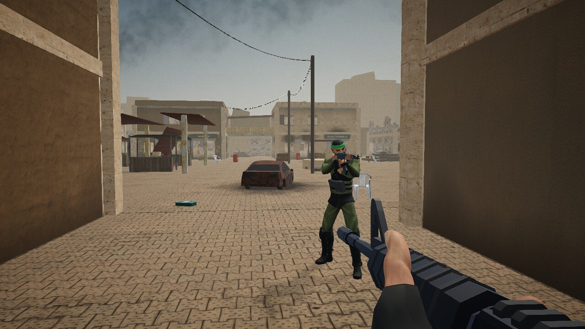
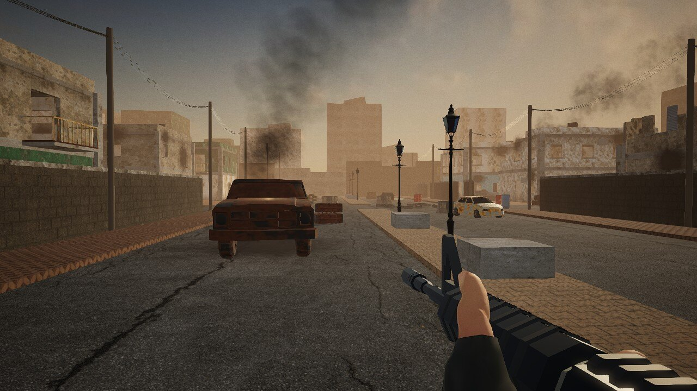
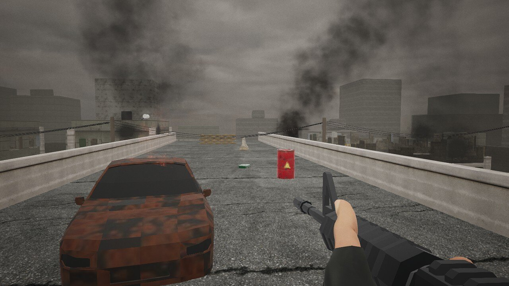
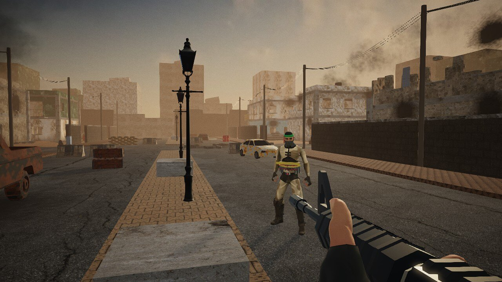
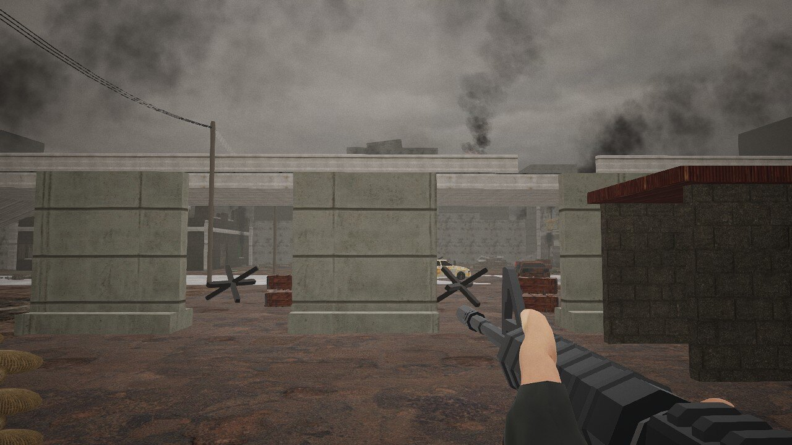

# IDF v Hamas

**Kill the waves of terrorists, save Israel!**

IDF v Hamas is a single-player first-person shooter that runs in a desktop web browser. You play an IDF soldier fighting through three war-damaged city districts against waves of armed Hamas combatants. There is nothing to install: the game is a static web page built with [Babylon.js](https://www.babylonjs.com/), and every model, texture and sound is bundled with it.

## Download

**[Download IDF v Hamas v1.00](https://github.com/rrcatto/IDFvHamas/releases/download/v1.00/idf-v-hamas-v1.00.zip)** (zip, 37.5 MB)

This is the ready-to-run game. Unzip it into any folder on a web server, for example `unzip idf-v-hamas-v1.00.zip -d /var/www/idfvhamas`, and open that address in a desktop browser. You don't need Node.js or npm, and it makes no outside requests. See [Build for a web server](#build-for-a-web-server) for an nginx example, and [Releases](https://github.com/rrcatto/IDFvHamas/releases) for all versions.



| | |
| --- | --- |
|  |  |
|  |  |

## The game

A campaign is three five-minute waves, one per map. Enemies keep coming until the clock runs out; you have unlimited lives but limited ammunition, and each map has five health packs and two ammunition crates that can each be used once. Score comes from kills (150 for a headshot, 100 otherwise) and dying costs time, not points.

Every human in the game is an armed combatant. There are no civilians or children.

### Maps

Each map is a different, battle-scarred part of a city, with its own layout, architecture, materials, sky and lighting. Every map has two-storey buildings you can enter, with walkable ground and first floors, internal or external stairs, balconies and windows to fight from.

| Wave | Map | Setting |
| --- | --- | --- |
| 1 | **Market Quarter** | Harsh midday sun and dust. Sandstone and plaster shops with roller shutters around a market square with stalls, a canopy and a dry fountain; narrow lanes, a covered footbridge between shops, a roofless ruin and a collapsed corner. |
| 2 | **Residential District** | Late-afternoon golden haze. Painted apartment blocks with balconies either side of a wrecked boulevard, walled courtyards, a pancaked building, a checkpoint and craters. |
| 3 | **Ruined Crossing** | Overcast, with smoke columns, falling ash and burning wrecks. A highway overpass whose collapsed span forms a ramp up to the deck, a T-wall checkpoint and sandbag bunker, a wrecked gas station, a hotel and a roofless warehouse. |

### Enemies

Fighters wear camouflage, olive, black or desert fatigues with chest rigs, a balaclava or face scarf and a green headband. They hunt you through the streets and up the stairs, react when they get a line of sight, fire in bursts and throw grenades.

- **Pistol fighters** (wave 1) and **riflemen** with AK-47s (wave 2 onwards).
- **RPG gunners** who prefer high positions (wave 3).
- **Suicide bombers** in a taped explosive vest with a blinking detonator light; you hear them beeping as they close in (wave 3).

Hits are resolved against hit boxes that follow the skeleton, so headshots are exact.

### Weapons and combat

- M4 carbine (30-round magazines), semi-automatic pistol (15 rounds), combat knife, fragmentation and smoke grenades.
- Aim down sights, sprint, crouch, jump and lean around cover.
- **Explosive fuel drums**: two hits rupture a drum, which burns for 1.6 seconds and then explodes, damaging everyone within 9 m and setting off nearby drums.
- Destructible crate cover, smoke that blocks enemy sight lines, and spent casings, tracers, bullet holes, blood and scorch marks.
- A heading-up minimap (forward is always up) showing nearby enemies, health and ammunition, and a warning marker that points to live enemy grenades.

### Controls

| Input | Action |
| --- | --- |
| W A S D / mouse | Move / look |
| Shift / Ctrl / Space | Sprint / toggle crouch / jump |
| Hold Q / E | Lean left / right |
| Left mouse | Fire, stab or throw |
| Right mouse | Aim down sights |
| R | Reload |
| 1 / 2 / 3 / 4 / 5 | Rifle / pistol / knife / frag grenade / smoke grenade |
| F | Use a nearby health pack or ammunition crate |
| Esc | Pause |

The menus set difficulty and, in Settings, mouse sensitivity, field of view, master, effects and music volume, and graphics quality (Low, Medium or High).

## Technology

| Area | What is used |
| --- | --- |
| Engine | [Babylon.js](https://www.babylonjs.com/) 9.28 (`@babylonjs/core` and `@babylonjs/loaders` for glTF/GLB) on WebGL 2 |
| Physics | [Havok Physics for Babylon.js](https://www.npmjs.com/package/@babylonjs/havok) (WebAssembly) for debris and fragments |
| Language and build | TypeScript (strict, ES modules) built with [Vite](https://vitejs.dev/) |
| Audio | Web Audio API: spatialised effects, separate music, ambience and effects buses, Ogg Vorbis assets |
| Tests | [Vitest](https://vitest.dev/) for game logic and map layouts; [Playwright](https://playwright.dev/) for browser tests in Chromium and Firefox |
| Asset pipeline | [Blender](https://www.blender.org/) (headless Python) for the characters, weapons, poses and vehicle wrecks; see `scripts/asset-pipeline/` |

**Rendering:**
- Physically based materials from photo-scanned textures.
- A per-map HDRI sky with image-based lighting and a sun matched to it.
- Percentage-closer filtered shadows and exponential fog.
- ACES tone mapping with a colour grade per map, plus bloom, sharpening and film grain.

**Performance:**
- Each district's static geometry is merged by material into a few dozen draw calls.
- Static collision is a single compound Havok body.
- Enemy line of sight uses a spatial-hash raycast against collision boxes, not mesh picking.
- Every shader the wave needs is compiled behind the loading screen, and lights are reused, never added mid-game, so the game doesn't stall in the middle of a fight.
- Effects are pooled.

**Navigation:** grid A* pathfinding over the collision map, including stairs and ramps between floors.

There is no backend, database, account system, analytics or persistent browser storage.

## Running the game

### Play locally

You need Node.js 22.12 or newer and a desktop Chromium-based browser or Firefox with hardware acceleration.

```sh
npm install
npm run dev
```

Open http://localhost:5173, choose a difficulty and click **Play**.

### Build for a web server

```sh
npm run build
```

This type-checks the code and writes the finished game to `dist/`. The `dist/` folder is the entire game:
- upload its contents to any static web server, at the site root or in a sub-folder;
- Node.js and npm are not needed on the server;
- the game makes no external requests.

A minimal nginx site:

```nginx
server {
    listen 80;
    server_name example.com;
    root /var/www/idfvhamas;
    index index.html;

    location / {
        try_files $uri $uri/ =404;
    }

    # the physics engine is WebAssembly
    location ~* \.wasm$ {
        default_type application/wasm;
    }
}
```

The game has to be served over HTTP or HTTPS; it does not run from a `file://` path. The download is about 45 MB, and each wave loads only the textures it needs.

To preview the production build locally, run `npm run preview` and open http://localhost:4173.

## Testing

```sh
npm run typecheck   # strict TypeScript
npm test            # Vitest: scoring, ammunition, damage, timers, map reachability, doorways
```

The browser tests need the development server running (`npm run dev`), plus `npx playwright install chromium firefox` the first time:

```sh
npm run test:browser                          # full gameplay run through all three waves
node tests/browser/cover-controls.mjs         # crouch, lean and supplies
node tests/browser/weapon-controls.mjs        # pistol, reload and weapon switching
GAME_URL=http://localhost:5173 node tests/browser/mouse-input.mjs
BROWSER=firefox GAME_URL=http://localhost:5173 node tests/browser/mouse-input.mjs
```

Against `npm run preview`, `PRODUCTION=1 npm run test:browser` checks the production build. It confirms that development hooks are stripped and that the game requests nothing from outside its own folder. Reports and screenshots go to `artifacts/`.

## Project layout

```text
src/
  config/      tuning: weapons, health, timing, difficulty; per-map sky, sun, fog and grading
  logic/       session state, statistics, damage and magazine accounting
  world/       building kit, the three map layouts, materials, environment and lighting, navigation
  entities/    player, first-person weapons, projectiles, enemy fighters and AI
  effects/     particles, decals, tracers, casings, fires, smoke and debris
  ui/          menus, HUD, minimap and styles
  audio.ts     Web Audio engine
  game.ts      game loop and lifecycle
public/assets/ models (GLB), PBR textures, skies and lighting, particle sprites, audio (Ogg)
scripts/       asset pipeline (Blender and download scripts) and a static test server
tests/         Vitest logic tests and Playwright browser tests
```

## Credits and acknowledgements

The game would not look or sound the way it does without the people who share their work for free. Everything below is either public domain (CC0) or licensed CC BY 3.0. The full list, with the exact files each asset was used for, is in [ASSET-CREDITS.md](ASSET-CREDITS.md), and the CC BY credits also appear in the in-game **Credits** screen.

**Models, textures and skies**
- [Poly Haven](https://polyhaven.com/) (CC0): every PBR surface texture, the three HDRI skies, and the props (fuel drums, crates, medical and ammunition boxes, barriers, lamps, shutters, gas bottles and more).
- [Quaternius](https://quaternius.com/) (CC0):
  - [Universal Base Characters](https://quaternius.itch.io/universal-base-characters), [Modular Character Outfits](https://quaternius.itch.io/modular-character-outfits-fantasy) and the [Universal Animation Library](https://quaternius.itch.io/universal-animation-library) for the fighters and the first-person arms;
  - the [Ultimate Gun Pack](https://quaternius.itch.io/50-lowpoly-guns) for the M4, AK-47, pistol and knife;
  - cars and a pickup truck from [Poly Pizza](https://poly.pizza/) for the vehicle wrecks.
- austincford, "RPG Launcher" on [Poly Pizza](https://poly.pizza/m/2qqg9SbrsZ) (CC BY 3.0).
- CreativeTrio, "Hand Grenade" on [Poly Pizza](https://poly.pizza/m/YWhHlmKOtx) (CC0).
- [Kenney](https://kenney.nl/) (CC0): particle sprites, smoke, splats and the explosion sprite sheet.

**Sound and music, from [OpenGameArt.org](https://opengameart.org/)**
- Matthew Pablo, "Tactical Pursuit": combat music (CC BY 3.0).
- Zander Noriega, "Perpetual Tension": menu music (CC BY 3.0).
- Michel Baradari ([apollo-music.de](https://apollo-music.de/)): explosions, rocket launch, and player pain and death sounds (CC BY 3.0).
- Blender Foundation, "Big Explosion" from *Yo Frankie!* (CC BY 3.0).
- congusbongus: enemy death cries and gravel footsteps (CC BY 3.0).
- Ben Jaszczak and contributors, *The Free Firearm Sound Library*: AR-15, Walther PPQ, AK-47 and 1911 recordings (CC0).
- SpringySpringo, qubodup, EmoPreben, HaelDB, NenadSimic, AntumDeluge and SketchMan3: reloads, pain and battle shouts, distant explosions, fire and wind (CC0).
- [Kenney](https://kenney.nl/) (CC0): impacts, footsteps, interface sounds, knife and casings.

**Software**
- [Babylon.js](https://github.com/BabylonJS/Babylon.js) by the Babylon.js contributors (Apache License 2.0).
- [Havok Physics for Babylon.js](https://www.npmjs.com/package/@babylonjs/havok) (MIT).

Their licence texts ship with the game in `THIRD-PARTY-LICENSES.txt`.

## Licence

The source code and the original work in this project (the game design, code, map layouts, building kit, and original sprites and sound mixes) are © 2026 Richard Catto, released under the [MIT Licence](LICENSE).

Third-party assets keep their own licences: CC0 or CC BY 3.0, as listed in [ASSET-CREDITS.md](ASSET-CREDITS.md). If you reuse a CC BY asset, you must credit its creator as shown there.

This is a work of fiction for entertainment. No real people, places, insignia or slogans are reproduced.
